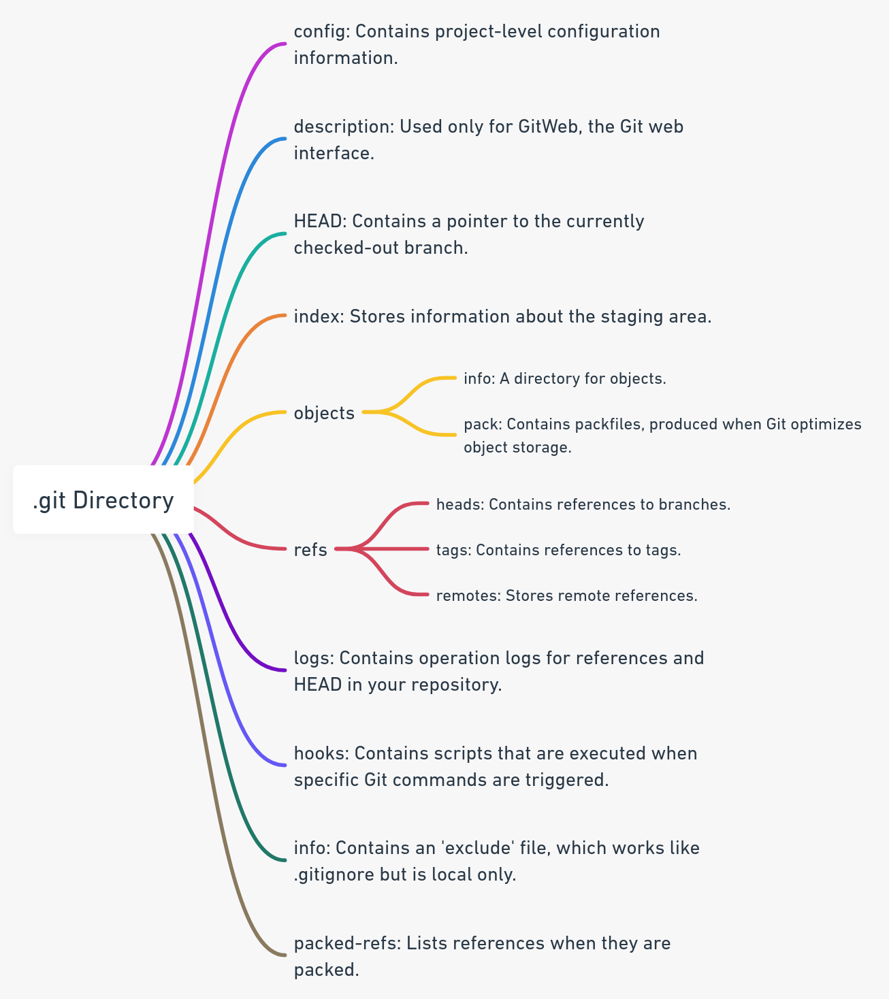

# git note
 
> Git is a free and open source distributed version control system designed to handle
> everything from small to very large projects with speed and efficiency.

# Git outline
1. [**Git简介**](#1-Git简介) 

    - 什么是Git？
    - Git的优势与特点
    - 分布式版本控制系统与集中式版本控制系统的比较

2. [**Git基础设置**](#2-Git基础设置)

    - 安装Git
    - 配置用户名和邮箱
    - 其他基本配置

3. [**Git基本命令**](#3-git基本命令)

    - 初始化仓库：`git init`
    - 克隆仓库：`git clone`
    - 查看状态：`git status`
    - 添加更改：`git add`
    - 提交更改：`git commit`
    - 查看日志：`git log`

4. [**分支管理**](#4-分支管理)
    - 创建分支：`git branch`
    - 切换分支：`git checkout`
    - 合并分支：`git merge`
    - 删除分支：`git branch -d`
    - 查看所有分支：`git branch -a`

5. [**远程仓库操作**](#5-远程仓库操作)
    - 添加远程仓库：`git remote add`
    - 获取远程更改：`git fetch`
    - 推送到远程：`git push`
    - 从远程拉取：`git pull`
    - 查看远程仓库：`git remote -v`

6. [**高级特性**](#6-高级特性)
    - 历史回滚：`git reset`
    - 使用 `git stash` 临时保存更改
    - 交互式rebase: `git rebase -i`
    - Cherry-pick 提取提交
    - 使用 `.gitignore` 忽略文件

7. [**合作与团队工作流**](#7-合作与团队工作流)
    - Fork 和 Pull Request
    - Feature Branch 工作流
    - Gitflow 工作流
    - Centralized Workflow

8. [**常见问题与解决方法**](#8-常见问题与解决方法)
    - 解决合并冲突
    - 撤销错误操作
    - 找回误删的提交

9. [**Git配合工具与服务**](#9-git配合工具与服务)
    - 使用 GitHub/GitLab/Bitbucket
    - 图形化客户端推荐（如 SourceTree, GitKraken）
    - 配合CI/CD工具

10. [**附录与推荐资源**](#10-附录与推荐资源)
    - Git命令速查表
    - 推荐书籍与在线教程
    - 相关社区与论坛

## 1. Git简介
- 什么是Git？
    > Git 的历史与它的起源是一个非常有趣的故事，涉及到了开源社区、Linux 内核以及如何高效地管理代码版本的需求。

    1. 前言

        > 在 git 出现之前，开发者们已经在使用其他版本控制系统，例如 cvs 和后来的 svn。但这些工具有其局限性，尤其在高度协作的大型项目（如 linux 内核）中。

    2. bitkeeper 时期

        > 在 2002 年之前，linux 内核开发团队使用的是一个叫做 bitkeeper 的分布式版本控制系统。虽然 bitkeeper 不是开源的，但其免费版本被 linux 社区广泛使用。
        > <br>然而，到了 2005 年，与 bitkeeper 的开发公司之间出现了一些争议，导致 linux 社区不能再免费使用它。

    3. git 的诞生

        > 由于上述原因，linus torvalds（linux 的创始人）决定开发一个新的版本控制系统，这个系统应该是免费的、开源的，并具有高效、安全、简单的特点。这就是 git 的起源。
        > <br> 2005 年，仅用了数天的时间，linus 就使用c语言初步完成了 git 的设计与编码。很快，git 开始被用于 linux 内核的开发。

    4. 发展

        > 由于 git 的出色性能和设计思想，很多项目开始使用 git 作为版本控制工具。随后，出现了许多基于 git 的平台和服务，如 github、gitlab 和 bitbucket，进一步促进了 git 的普及。

    5. 当前状态

        > 今天，git 已经成为了版本控制领域的事实标准，被全球数百万的开发者和大多数开源项目所使用。


- Git的优势与特点

    - **分布式**：与其它系统如 svn（集中式版本控制系统）不同，git 是分布式的。每个开发者在本地都有一个完整的代码库副本，允许多个开发者同时工作,这大大提高了操作的速度，并增强了系统的健壮性。

    - **安全性**：git 使用 sha-1 散列算法，确保代码的完整性和一致性。

    - **灵活性**：支持非线性开发流程，允许数千个并行分支,可以处理大项目。

- 分布式与集中式的比较

    - 分布式（如Git）：每个开发者拥有仓库的完整副本。
    - 集中式（如SVN）：单一的中心化版本库，开发者只获取最新的快照。

- .git目录结构：
    

## 2. Git基础设置

- 安装Git

    - **Linux**: sudo apt-get install git
    - **Mac**: brew install git
    - **Windows**: 下载并安装Git官方安装程序。

- 配置用户名和邮箱

    ```bash
        git config --global user.name "your name"
        git config --global user.email "your@email.com"
    ```
- 第一次使用ssh推送本地仓库到github仓库
    > 如果是第一次使用ssh推送，需要设置ssh-key
    1. 切换到~/.ssh/

        ```bash
            cd ~/.ssh/
        ```

    2. ls 查看信息，没有id_rsa和id_rsa.pub文件表明没有创建ssh-key，用下面命令创建ssh-key:

        ```bash
            # -t：使用ras加密方式，-b：4096大小
            ssh-keygen -t rsa -b 4096
        ```
        `tips`：命令执行后，第一次创建ssh-key一路默认回车即可

    3. ls 查看信息，这时我们可以看见多了id_rsa和id_rsa.pub文件

        - id_rsa：私钥文件，谁也不要给
        - id_rsa.pub: 公钥文件

    4. 在github配置ssh-key

        - 打开github，点击头像，点击Settings
        - 点击SSH and GPG keys 按钮
        - 新建ssh-key，粘贴复制的公钥内容到key内容框，填一个标题
        - 点击Add SSH key按钮，即可创建成功，本地机器即可通过ssh推送仓库到github上了

- 其他基本配置

    - 设置默认的文本编辑器（如vim）: git config --global core.editor vim
    - 查看当前配置: git config --list

## 3. Git基本命令

- 初始化仓库

    ```bash
        git init
    ```
- 克隆仓库

    ```bash
        git clone [url]
    ```
- 查看状态

    ```bash
        git status
    ```
- 添加更改

    ```bash
        git add [file or directory]
    ```
- 提交更改

    ```bash
        git commit -m "commit message"
    ```
- 查看日志

    ```bash
        git log
    ```
## 4. 分支管理

- 创建分支

    ```bash
        git branch [branch-name]
    ```
- 切换分支

    ```bash
        git checkout [branch-name]
    ```
- 合并分支

    ```bash
        git merge [branch-name]
    ```
- 删除分支

    ```bash
        git branch -d [branch-name]
    ```
- 查看所有分支

    ```bash
        git branch -a
    ```
## 5. 远程仓库操作

- 添加远程仓库

    ```bash
        git remote add [name] [url]
    ```

- 获取远程更改

    ```bash
        git fetch [remote-name]
    ```

- 推送到远程

    ```bash
        git push [remote-name] [branch-name]
    ```

- 从远程拉取

    ```bash
        git pull [remote-name] [branch-name]
    ```

- 查看远程仓库

    ```bash
        git remote -v
    ```

## 6. 高级特性

- 历史回滚

    ```bash
        git reset [commit]
    ```

- 使用 git stash 临时保存更改

    ``` bash
        git stash save "description"
    ```

- 交互式rebase

    ```bash
        git rebase -i [base-commit]
    ```

- Cherry-pick 提取提交

    ```bash
        git cherry-pick [commit]
    ```
- 使用 .gitignore 忽略文件

    - 在项目根目录下创建 .gitignore 文件。
    - 添加要忽略的文件或文件夹名。

## 7. 合作与团队工作流

- Fork 和 Pull Request

    - 在GitHub上对原始仓库进行fork。
    - 克隆fork的仓库到本地。
    - 创建一个新的分支进行更改。
    - 提交更改并推送到fork的仓库。
    - 在GitHub上提交一个pull request给原始仓库。

- Feature Branch 工作流
    - 为新功能创建一个分支。
    - 开发完成后，合并到主分支。
    - 删除功能分支。

- Gitflow 工作流

    - 维护两个主要分支：`master` 和 `develop`。
    - 功能开发在 `feature` 分支上。
    - 为发布准备创建 `release` 分支。
    - 紧急问题在 `hotfix` 分支上修复。

- Centralized Workflow

    - 所有开发者在一个单一的分支上工作。
    - 合并更改前先从主分支拉取最新的更改。

## 8. 常见问题与解决方法

- 解决合并冲突

    - 手动编辑发生冲突的文件，解决差异。
    - 保存并提交更改。

- 撤销错误操作

    ```bash
        git reflog
        git reset --hard [commit]
    ```

- 找回误删的提交

    ```bash
        git fsck --lost-found
    ```

## 9. Git配合工具与服务

- 使用 GitHub/GitLab/Bitbucket

    - 注册账号并创建新仓库。
    - 克隆仓库到本地进行开发。
    - 推送更改到线上仓库。

- 图形化客户端推荐（如 SourceTree, GitKraken）

    - 提供直观的界面来执行Git操作。
    - 可视化提交历史和分支。

- 配合CI/CD工具

    - 自动化代码测试和部署。
    - 与云服务如AWS, Google Cloud等集成。

## 10. 附录与推荐资源

- Git命令速查表

    - 提供常用Git命令的简洁列表。

- 推荐书籍与在线教程

    - "Pro Git" by Scott Chacon and Ben Straub。
    - [Git官方文档](https://git-scm.com/documentation)

- 相关社区与论坛

    - [Stack Overflow](https://stackoverflow.com/): 专门的Git标签用于问题。
    - [Git的邮件列表](https://git-scm.com/community)

