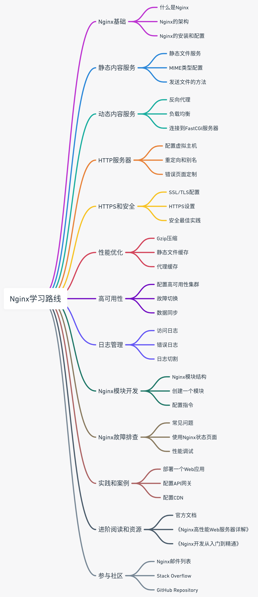

# nginx 

**OUTLINE** 

## 1. Nginx基础
- 什么是Nginx
- Nginx的架构
- Nginx的安装和配置

## 2. 静态内容服务
- 静态文件服务
- MIME类型配置
- 发送文件的方法

## 3. 动态内容服务
- 反向代理
- 负载均衡
- 连接到FastCGI服务器

## 4. HTTP服务器
- 配置虚拟主机
- 重定向和别名
- 错误页面定制

## 5. HTTPS和安全
- SSL/TLS配置
- HTTPS设置
- 安全最佳实践

## 6. 性能优化
- Gzip压缩
- 静态文件缓存
- 代理缓存

## 7. 高可用性
- 配置高可用性集群
- 故障切换
- 数据同步

## 8. 日志管理
- 访问日志
- 错误日志
- 日志切割

## 9. Nginx模块开发
- Nginx模块结构
- 创建一个模块
- 配置指令

## 10. Nginx故障排查
- 常见问题
- 使用Nginx状态页面
- 性能调试

## 11. 实践和案例
- 部署一个Web应用
- 配置API网关
- 配置CDN

## 12. 进阶阅读和资源
- 官方文档
- 《Nginx高性能Web服务器详解》
- 《Nginx开发从入门到精通》

## 13. 参与社区
- Nginx邮件列表
- Stack Overflow
- GitHub Repository

